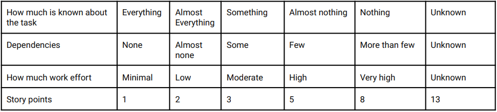

#### A JS project on top of React + Vite
#### Manifest V3

## Get start
```bash
clone the project
```

## First install dependencies & run 
```bash
npm install
npm run dev
```

## Build
```bash
npm run build
```

## To set in chrome extension 
```bash
open chrome browser make sure that developer mode turned on in chrome extension section then click load unpacked and upload newly created dist folder which created by running npm run build

now click in extension and check
```
## Overview
Simple story calculation app based on all selected options by user it will check all the selected options respective value (values from story point matrix) and show the max value from all of the selected option as story point  




### Flow


### Features
    Dark mood 
    Responsive 
    Chrome extension (manifast.json) file added
    Story point calculation
    

### Feature Extension 
    It's possible to extend feature like adding more select parameters and calculate story point for all of them.

    Procedure
    1. Add option file in constant folder
    2. Add selector component and it's state and pass options 
    3. Also pass state value Param in max calculation function
    4. It's possible to add new color for new value in utils folder's color file
    5. Done new selection mechanism added
